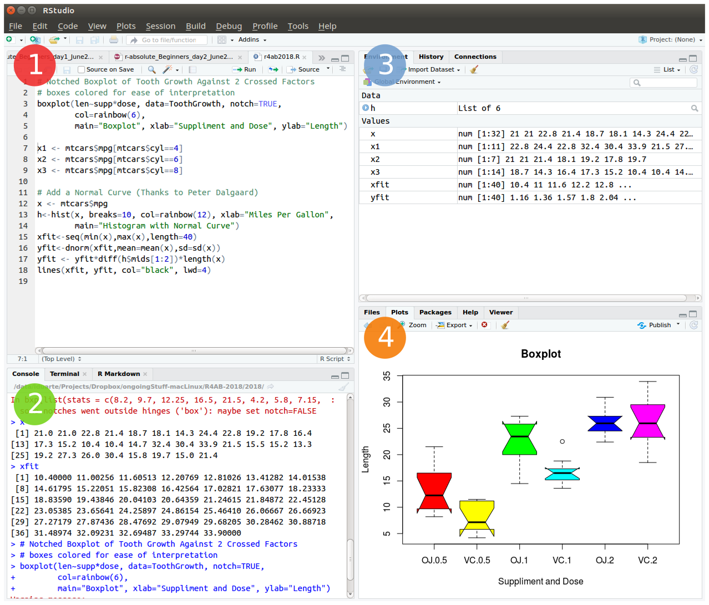

# **Learn R**

### **1. Using RStudio**

The practical classes for this course require R and RStudio.

Please read the `General information` tab to get information on how to use your RStudio Server account from the virtual machines at UAlg (provided by the instructor), or how to install R and RStudio in your system.

The friendliest way to learn R is to use **RStudio** which is an Integrated Development Environment - **IDE** - that includes:    

(1) a **text editor** with syntax-highlighting (where you save the R code in a script to run again in the future);
(2) an **R console** to execute code (where the R instructions are executed and evaluated to generate the output);
(3) a **workspace** and **history** management;
(4) and  tabs to visualize **plots** and **exporting** images, **browsing** the files in the workspace, managing **packages**, getting **help** with functions and packages, and **viewing** html/pdf or **presentation** files created within RStudio (using RMarkdown). 




<br>

### **2. Load the *swirl* package & Follow the guided course**

After you become familiarized with RStudio, we shall progress to the **interactive, self-paced, hands-on tutorial** provided by the *swirl* package. You will *learn R inside R*. 
For more info about this package, visit: <https://swirlstats.com/>

<br>

Type these instructions in the R console (panel number 2 of RStudio). 
The words after a `#` sign are called comments, and are not interpreted by R, so you do not need to copy them.  
You can copy-paste the code, and press enter after each command. 

```{r swirl, eval=FALSE}

install.packages("swirl")   # Install swirl (once if not installed)

library("swirl")            # Load the swirl package to make it available for you to use
swirl()                     # Start swirl

```

After starting `swirl`, follow the instructions given by the program, and complete all of the following lessons:

**Please install the course:**  
1: R Programming: The basics of programming in R 

**Choose the course:**  
1: R Programming

**Complete the following lessons, in this order:**  
1: Basic Building Blocks  
3: Sequences of Numbers  
4: Vectors   
5: Missing Values   
6: Subsetting Vectors   
7: Matrices and Data Frames  
8: Logic   
12: Looking at Data  
15: Base Graphics  

<br>

**Please call the instructor for any question, or if you require help.**  
Now, just *Keep Calm... and Good Work!*

---
