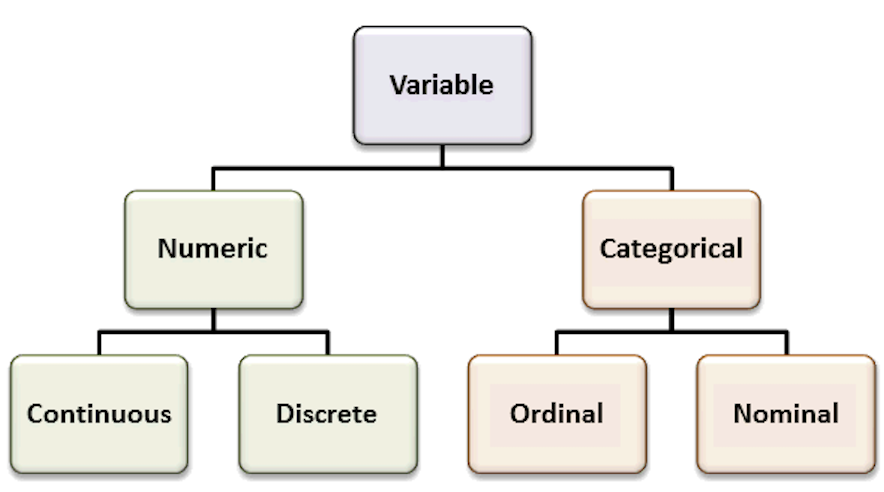
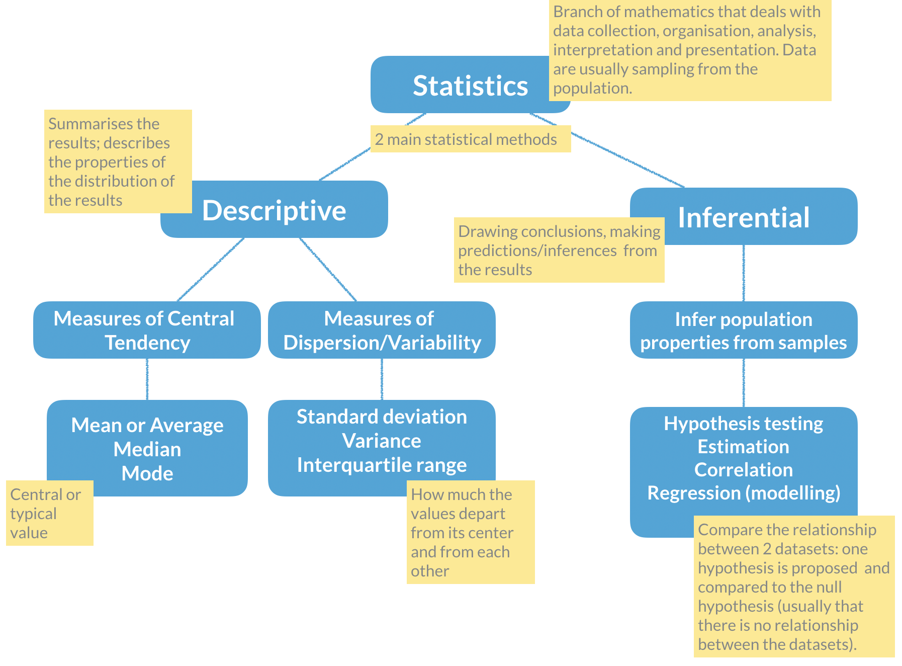

# **Practice R**

## **Descriptive statistics in R**

If you already have some R programming skills, you can practice them here by doing a brief summary statistics analysis and data visualization of a very simple dataset. 

> **The scientific experiment** | You are interested in determining if a high-fat diet causes mice to gain weight, after one month. For this study, you obtained data from 60 mice, where half were fed a lean-diet, and the other half a high-fat diet. All other living conditions were the same. Four weeks after, all mice were weighted, and the sex and age were also recorded. The results were saved in [`mice_data.txt`](data/mice_data.txt) file. 

### **Start by discussing the experimental design**

- What is the research question? What is the hypothesis?   
- How many variables are in the study?   
- Which variable(s) are **dependent**? (Dependent or Response variables are the variables that we are interested in predicting or explaining.)   
- Which variable(s) are **independent**? (Independent or Explanatory variables are used to explain or predict the dependent variable.)   
- Which variable(s) are **covariates**? (Covariates are variables that are potentially related to the outcome of interest in a study, but are not the main variable under study - used to control for potential confounding factors in a study.)   
- Are the "controls" appropriate? Why?

<br>

Recall the most common variable types. The types of the variables will define the analyses and visualizations that are possible.

{width=600px}

<br>

### **Organize your data analysis project**

To keep your files organized and easy to find, it's a good idea to set up a clear naming system before you start collecting data for your thesis (or any other research-related data analysis). 

A file naming convention is a consistent way to name files so it's clear what's inside and how each file connects to others. This helps you quickly understand and locate files, avoiding confusion or lost data later on.

**1. Create a directory for the computatinal biology classes.** 

A key part of good data management is organizing your data effectively. This means planning how you’ll name files, arrange folders, and show relationships between them.   
Researchers should set up folder structures that reflect how records were created and align with their workflows. Doing this improves clarity, makes it easier to save, find, and archive files, and supports collaboration across teams.

**Establishing a clear file structure and naming system before collecting data ensures consistency and helps team members work more efficiently together.**

We propose the following **minimal** structure inside a folder that identifies the :

    project_nickname/    
    ├── data/    
    │ ├── raw/    
    │ └── processed/
    │ └── metadata/    
    ├── scripts/    
    ├── output/    
    └── docs/   

+ **project_nickname**: root folder for the Rproject (for example: r_comp_biol)    
+ **data/raw**: original, unmodified data   
+ **data/processed**: cleaned or transformed data ready for analysis
+ **data/metadata**: description of the contents in the data folder (learn more about [metadata](https://rdmkit.elixir-europe.org/metadata_management))
+ **scripts**: code for processing and analysis   
+ **output**: figures, tables, and final results   
+ **docs**: project documentation with supplementary files that are not data or analysis related

<br>

**2. Create an RStudio project**

RStudio Projects are a great functionality, easing the transition between dataset analyses, and allowing a fast navigation to your analysis/working directory. To create a new project:

    File > New Project... > New Directory > New Project
    Directory name: comp_biol_r
    Create a project as a subdirectory of: ~/
                               Browse... (folder that you created for the computational biology classes)
    Create Project
    
Projects should be personalized by clicking on the menu in the right upper corner. The general options - **R General** - are the most important to customize, since they allow the definition of the RStudio "behavior" when the project is opened. The following suggestions are particularly useful:

    Restore .RData at startup - No (for analyses with +1GB of data, you should choose "No")
    Save .RData on exit - Ask
    Always save history - Yes


<br>

**3. Create a new R script file** 

In order to save your work, you must create a new R script file. Go to `File > New File > R Script`. A blank text file will appear above the console. Save it to your project folder with the name `comp_biol_mice.R`

::: {.callout-note collapse="true" title="Why do we need scripts?"}

A script is a text file with a sequence of instructions that the computer runs to perform a task.

In R, you save the commands used in your analysis so you can run them again later. This makes your work reproducible, objective, and easy to update if the data change.

Although writing a script takes time at first, it allows you to work more efficiently in the long term. You can also share it with collaborators so they can review, improve, or extend your work. Many scientific journals now require authors to submit the analysis scripts with their manuscripts.

:::

### **Load data and inspect it** 

1. Download the file `mice_data.txt` (mice weights according to diet) from [here](data/mice_data.txt).  
2. Create a folder named `data` inside your current working directory (where the RProject was created), and upload the `mice_data.txt` to the `data` folder.
3. Type the instructions inside grey boxes in pane number 2 of RStudio - the R Console. As you already know, the words after a `#` sign are comments not interpreted by R, so you do not need to copy them.    
    - In the **R console**, you must hit **`enter` after each command** to obtain the result. 
    - In the **script file** (R file), you must **`run`** the command by **pressing the run button** (on the top panel), or by **selecting the code** you want to run **and pressing `ctrl + enter`**.
4. Save all your relevant/final commands (R instructions) to your script file to be available for later use. 

```{r loadData, warning=FALSE}

# Load the file and save it to object mice_data
mice_data <- read.table(file = "data/mice_data.txt", 
                        header = TRUE,
                        sep = "\t", 
                        dec = ".",
                        stringsAsFactors = TRUE)
```

```{r viewData, echo=TRUE, eval=FALSE}
# Briefly explore the dataset
View (mice_data)       # Open a tab in RStudio showing the whole table
```

```{r exploreData}
head (mice_data, 10)   # Show the first 10 rows
tail (mice_data, 10)   # Show the last 10 rows
str(mice_data)         # Describe the class of each column in the dataset
summary (mice_data)    # Get the summary statistics for all columns
```

To facilitate further analysis, we will create 2 separate data frames: one for each type of diet.

```{r createTables}
# Filter the diet column by lean or fat and save results in a data frame
lean <- subset (mice_data, diet == "lean")
fat <- subset (mice_data, diet == "fat")

# Look at the new tables
head (lean)
head (fat)
```

<br>

### **Descriptive statistics and Plots using R**

Now, we should look at the **distributions** of the variables. 
First we will use **descriptive statistics** that summarize the sample data. 
We will use measures of central tendency: **Mean, Median, and Mode**, and measures of dispersion (or variability): **Standard Deviation, Variance, Maximum, and Minimum**.   

```{r descStat}
# Summary statistics per type of diet - min, max, median, average, standard deviation and variance 
summary(lean)      # quartiles, median, mean, max and min
sd (lean$weight)   # standard deviation of the weight
var(lean$weight)   # variance of the weight (var=sd^2)

summary(fat)
sd (fat$weight)   
var(fat$weight)
```

<br>

### **How is the variable "mouse weight" distributed in each diet? | Histograms**

After summarizing the data, we should find appropriate plots to look at it. 
A first approach is to look at the frequency of the mouse weight values per diet using a **histogram**.   

::: {.callout-tip collapse="true" title="Recall Histograms"}

Histograms plot the distribution of a continuous variable (x-axis), in which the data is divided into a set of intervals (or bins), and the count (or frequency) of observations falling into each bin is plotted as the height of the bar. 

:::


```{r histogram_ggplot, warning=FALSE, message=FALSE}

# install.packages("ggplot2")       # package for plotting
# install.packages("RColorBrewer")  # color palettes
# install.packages("patchwork")     # combine plots

library(ggplot2)
library(RColorBrewer)
library(patchwork)

# Lean diet histogram
ggplot(lean, aes(x = weight)) +
  geom_histogram(
    binwidth = 5,
    color="white", 
    fill="skyblue1"
  ) +
  labs(
    x = "Mouse weight",
    title = "Lean Diet | Histogram of mouse weight",
    subtitle = "Binwidth = 5"
  ) +
  theme_minimal() -> lean_histogram    # save the plot

# Print the plot
lean_histogram

# Fat diet histogram
ggplot(fat, aes(x = weight)) +
  geom_histogram(
    binwidth = 1,
   color="white", 
    fill="seagreen3"
  ) +
  labs(
    x = "Mouse weight",
    title = "Fat Diet | Histogram of mouse weight",
    subtitle = "Binwidth = 1"
  ) +
  theme_minimal() -> fat_histogram    # save the plot

# Print the plot
fat_histogram

# Combine both histograms in the same plot using patchwork
  # Notice the different y axis scales
lean_histogram + fat_histogram

# Combine histograms with ggplot2 faceting
  # Axis scales can be formatted (the same or individual)
ggplot(mice_data, aes(x=weight, fill=diet)) +
  geom_histogram(binwidth=5, color="white") +
  facet_grid(~ diet)

```

<br>

### **How is the variable "mouse weight" distributed in each diet? | Boxplots**

Since our data of interest is one **categorical variable** (type of diet), and one **continuous variable** (weight), a **boxplot** is one of the most informative. 

::: {.callout-tip collapse="true" title="Recall Boxplots"}

A **boxplot** represents the distribution of a continuous variable.
The box in the middle represents the **interquartile range (IQR)**, which is the range of values from the first quartile to the third quartile, and the **line inside the box** represents the **median** value (i.e. the second quartile). 
The lines extending from the box are called **whiskers**, and represent the range of the data outside the box, i.e. the **maximum** and the **minimum**, excluding any outliers, which are shown as points outside the whiskers (not present in this dataset).
**Outliers** are defined as values that are more than 1.5 times the IQR below the first quartile or above the third quartile.

:::

```{r boxplot}

# Box and whiskers plot - BASIC
ggplot(mice_data, aes(x=diet, y=weight)) +
  geom_boxplot()

# Add color (from default ggplot palette)
ggplot(mice_data, aes(x=diet, y=weight)) +
  geom_boxplot(aes(fill=diet))

# Choose the colors, add X and Y axis names and the Title
    # Notice that the fill argument is not inside the aesthetics function
ggplot(mice_data, aes(x=diet, y=weight)) +
  geom_boxplot(fill=c("lightpink", "lightgreen")) +
  labs(x = "Diet",
       y = "Mouse weight (g)",
      title = "Boxplot of mouse weight"
    )

# Add points to the boxplot
ggplot(mice_data, aes(x = diet, y = weight)) +
  geom_boxplot(
    fill = c("lightpink", "lightgreen")
  ) +
  geom_jitter(
    width = 0.15,        # horizontal spread
    alpha = 0.7,         # transparency
    size = 2
  ) +
  labs(
    x = "Diet",
    y = "Mouse weight (g)",
    title = "Boxplot of mouse weight"
  )

```

### **How are the other variables distributed?**

There are other variables in our data for each mouse that could influence the results, namely **gender** (categorical variable) and **age** (discrete variable). We should also look at these data. 

::: {.callout-tip collapse="true" title="Recall Barplots"}

A **barplot** represents the distribution of a **categorical variable** or the summary of a continuous variable across categories.
Each **bar** corresponds to a category, and its **height** represents the value associated with that category, typically the **count (frequency)** or the **proportion** of observations.

When summarising a continuous variable, the height of the bar usually represents a **summary statistic**, such as the **mean** or the **median**, computed within each category.

The bars are separated by spaces to emphasise that the categories are **discrete** and do not have an intrinsic numerical continuity.

:::

```{r distr_other_var}

# Boxplot of diet and gender
ggplot(mice_data, aes(x=interaction(diet, gender), y=weight, 
                      fill=interaction(diet, gender))) +
  geom_boxplot() +
  geom_jitter(
    width = 0.15,        # horizontal spread
    alpha = 0.7,         # transparency
    size = 2             # point size
  ) +
  labs(
    x = "Diet and Gender interaction",
    y = "Mouse weight (g)",
    title = "Boxplot of mouse weights per diet type and gender"
  )

# Barplot of mice age
ggplot(mice_data, aes(x=age_months)) +
  geom_bar(fill="mediumpurple1",
           color="white") +
  labs(
    x = "Mice age (months)",
    y = "Count",
    title = "Barplot of mice age"
  ) +
  theme_light()  # simple and light background for the plot

```

<br>

### **What is the frequency of each variable?**

When exploring the results of an experiment, we want to learn about the variables measured (age, gender, weight), and how many observations we have for each variable (number of females, number of males ...), or combination of variables, for example, number of females in lean diet. This is easily done by using the function `table`. This function outputs a frequency table, i.e. the frequency (counts) of all combinations of the variables of interest. 

```{r freq_table}

# How many measurements do we have for each gender (a categorical variable)
table(mice_data$gender)

# How many measurements do we have for each diet (a categorical variable)
table(mice_data$diet)

# How many measurements do we have for each gender in each diet? 
  # (Count the number of observations in the combination between 
  # the two categorical variables).
table(mice_data$diet, mice_data$gender)

# We can also use this for numerical discrete variables, like age.
# How many measurements of each age (a discrete variable) do we have by gender? 
table(mice_data$age_months, mice_data$gender)

# And by diet type? 
table(mice_data$age_months, mice_data$diet)

# What if we want to know the results for each of the three variables:
  # age, diet and gender? Using ftable instead of table to format the
  # output in a more friendly way
ftable(mice_data$age_months, mice_data$diet, mice_data$gender)

```

<br>

### **Bivariate Analysis | Linear regression and Correlation coefficient**

**Is there a dependency between the age and the weight of the mice in our study?**

To test if two variables are correlated we will start by:

 - Making a scatter plot of these two variables;
 - Followed by a calculation of the Pearson correlation coefficient;
 - Finally, fitting a linear model to the data to evaluate how the weight changes depending on the age of the mice.

```{r correlation}

# First step: scatter plot of age and weight 
# Note that the dependent variable is the weight, so it should be in the y axis,
  # and the independent variable (age) should be in the x axis.
ggplot(mice_data, aes(x=age_months, y=weight)) +
  geom_point(shape=19, size=2)

# Second step: Calculate the Pearson coefficient of correlation (r)
my.correlation <- cor(mice_data$weight, 
                      mice_data$age_months, 
                      method = "pearson")
my.correlation

# Third step: fit a linear model (using the function lm) to check the coefficients overall
my.lm <- lm (weight ~ age_months, data=mice_data) 
my.lm

# Fit a line with confidence interval
ggplot(mice_data, aes(x = age_months, y = weight)) +
  geom_point(shape = 19, size = 2.5, alpha = 0.7) +
  geom_smooth(method = "lm", se = TRUE, formula = y ~ x) +
  labs(
    y = "Weight (g) [Dependent variable]",
    x = "Age (months) [Independent variable]"
  )

# Fit one line per diet type
  # Just add a color grouping and ggplot fits one line per group
ggplot(mice_data, aes(x = age_months, y = weight, color = diet)) +
  geom_point(shape = 19, size = 2.5, alpha = 0.7) +
  geom_smooth(method = "lm", se = FALSE, formula = y ~ x) +
  labs(
    y = "Weight (g) [Dependent variable]",
    x = "Age (months) [Independent variable]",
    color = "Diet"
  )

```

<br>

### **Hypothesis testing and Statistical significance using R**

Going back to our original question: *Does the type of diet influence the body weight of mice?*   
Can we answer this question just by looking at the plot? Are these observations compatible with a scenario where **the type of diet does not influence body weight?**  

Remember the basic statistical methods:

{width=600px}

Here enters **hypothesis testing**. In hypothesis testing, the investigator formulates a **null hypothesis (H0)** that usually states that *there is no difference between the two groups*, i.e. the observed weight differences between the two groups of mice occurred only due to sampling fluctuations (like when you repeat an experiment drawing samples from the same population). In other words, H0 corresponds to an absence of effect.  
The **alternative hypothesis (H1)**, just states that the *effect is present between the two groups*, i.e. that the samples were taken from different populations.

Hypothesis testing proceeds with using a **statistical test to try and reject H0**. For this experiment, we will use a *T-test that compares the difference between the means of the two diet groups*, yielding a p-value that we will use to decide if we reject the null hypothesis, at a 5% significance level (p-value < 0.05). Meaning that, if we repeat this experiment 100 times in different mice, in 5 of those experiments we will reject the null hypothesis, even thought the null hypothesis is true.

```{r hypothesis}

# Apply a T-test to the lean and fat diet weights 

### Explanation of the arguments used ###
  # alternative="two.sided": two-sided because we want to test any difference 
  # between the means, and not only weight gain or weight loss 
  # (in which case it would be a one-sided test)

  # paired=FALSE: because we measured the weight in 2 different groups of mice
  # (never the same individual). If we measure a variable 2 times in the same
  # individual the data would be paired.

  # var.equal=TRUE: T-tests apply to equal variance data, so we assume it is
  # TRUE and ask R to estimate the variance (if we chose FALSE, then R uses
  # another similar method called Welch (or Satterthwaite) approximation) 

ttest <- t.test(lean$weight, fat$weight,
                alternative="two.sided", 
                paired = FALSE, 
                var.equal = TRUE)

# Print the results
ttest

```

<br>

### Now that we have calculated the T-test, shall we accept or reject the null hypothesis? What are the outputs in R from the t-test?

```{r ttest}

# Find the names of the output from the function t.test
names(ttest)

# Extract just the p-value
ttest$p.value

```

<br>

### **Final discussion**

>> Take some time to discuss the results with your classmates, and decide if H0 should be rejected or not, and how confident you are that your decision is reasonable. 
Can you propose solutions to improve your confidence on the results? Is the experimental design appropriate for the research question being asked? Is this experiment well controlled and balanced?

---
