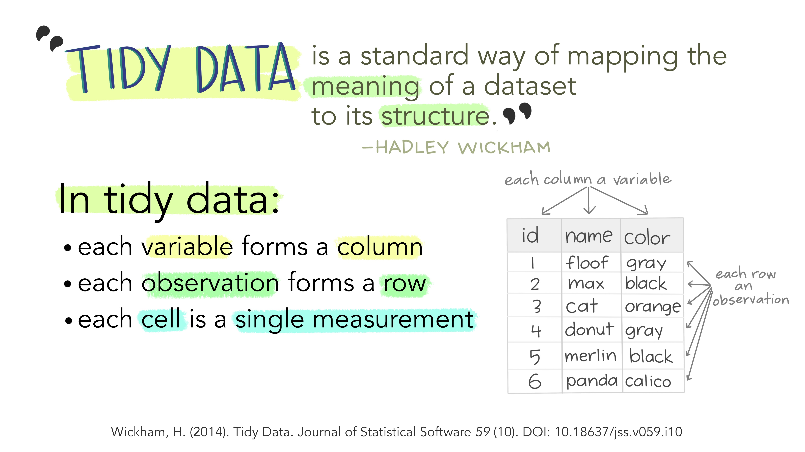
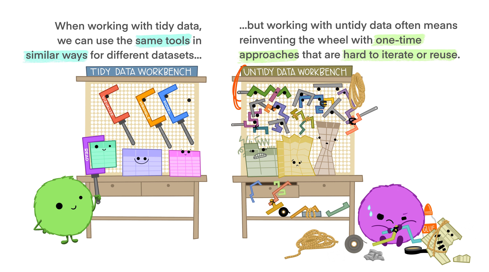

## **Tidy Data: Structuring Data for Analysis**

### **Data Tidying**
A significant portion of data analysis involves cleaning and preparing data. This process is iterative, as new issues arise or additional data is collected. A key aspect of cleaning is **data tidying**, which focuses on structuring datasets to facilitate analysis.

The principles of **tidy data** provide a standardized way to organize data, simplifying initial cleaning and ensuring compatibility with analysis tools. Tidy datasets reduce the need for data transformation between tools, allowing analysts to focus on meaningful insights rather than data logistics.

### **Defining Tidy Data**
Tidy data aligns the structure of a dataset with its meaning. It follows three key principles:

1. Each **variable** is a column.
2. Each **observation** is a row.
3. Each **value** is a single cell.

This structure makes analysis more efficient by ensuring that variables and observations are consistently represented.

### **Data Structure & Semantics**

Data consists of **values** that belong to:

- **Variables**: Attributes measured across units (e.g., height, score).
- **Observations**: Measurements for a single unit (e.g., a person, a test result).

Different structures can represent the same data. For instance, wide and long formats can hold identical information but differ in layout. A **tidy format** ensures that each row represents a distinct observation, making relationships between values explicit.

### **Benefits of Tidy Data**
- **Easier manipulation:** Standardized structure allows simple extraction and transformation.
- **Error reduction:** A consistent format prevents mistakes in processing.
- **Better tool compatibility:** Tidy datasets integrate seamlessly with vectorized programming languages like R.
- **Efficient analysis:** Aggregations and comparisons are straightforward.

### **Organizing Variables & Observations**
- Variables can be **fixed** (defined by study design) or **measured** (collected during the study).
- Ordering variables logically improves readability and comprehension.
- Data should be arranged so that related observations and variables are contiguous, improving interpretability.

### **Take home message**

By following tidy data principles, researchers can streamline workflows, minimize errors, and enhance the clarity of their datasets.

----

### Citations

- Illustrations from the *Openscapes blog: Tidy Data for reproducibility, efficiency, and collaboration* by Julia Lowndes and Allison Horst (<https://openscapes.org/blog/2020-10-12-tidy-data/>)

- Content based on:   

1. <https://cran.r-project.org/web/packages/tidyr/vignettes/tidy-data.html>
2. *Wickham, H. (2014). Tidy Data. Journal of Statistical Software, 59(10), 1–23. <https://doi.org/10.18637/jss.v059.i10>*

