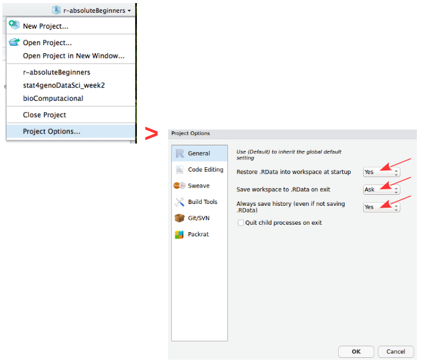
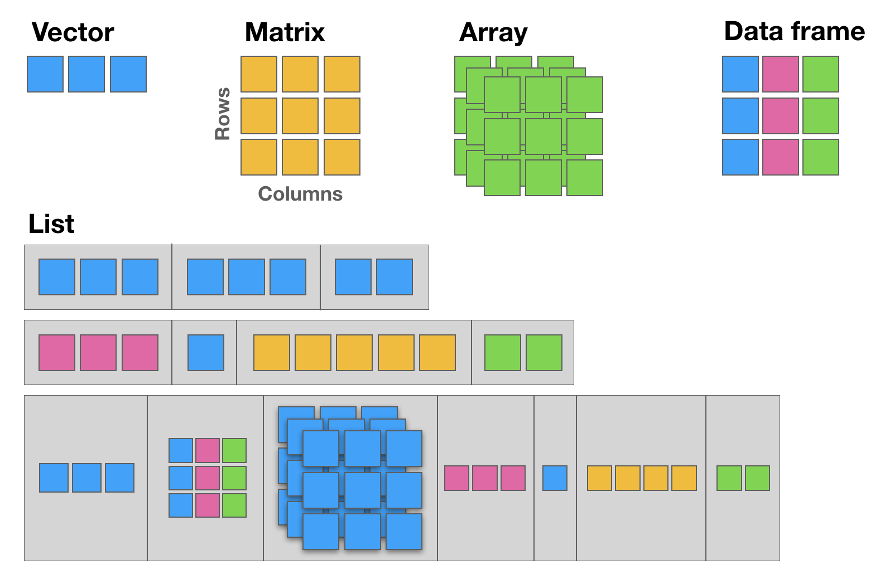

#### **R4AB | Hands on tutorial**

This mini hands-on tutorial serves as an introduction to basic R, covering the following topics:

-   Packages, Documentation and Help;
-   Basics and syntax of R;
-   Main R data structures: Vectors, Matrices, Data frames, Lists, and Factors;
-   Brief intro to R control-flow via Loops and Conditionals;
-   Brief description of function declaration;
-   Listing of some of the most commonly used built-in functions in R.

<br>

#### Tutorial organization

This protocol is divided into **7 parts**, each one identified by a **Title**, **Maximum execution time** (in parenthesis), a brief **Task description** and the **R commands** to be executed. These will always be inside grey text boxes, with the font colored according to the R syntax highlighting.

<br>

### Self-paced tutorial

### Create an RStudio project (30 min)

To start we will open RStudio. This is an Integrated Development Environment - **IDE** - that includes syntax-highlighting **text editor** (1 in Figure1), an **R console** to execute code (2 in Figure1), as well as **workspace** and **history** management (3 in Figure1), and tools for **plotting** and **exporting** images, **browsing** the workspace, managing **packages** and **viewing** html/pdf files created within RStudio (4 in Figure1).

{width="600px"}


Projects are a great functionality, easing the transition between different dataset analyses, and allowing a fast navigation to your analysis/working directory. To create a new project:

```         
File > New Project... > New Directory > New Project
Directory name: r_absolute_beginners
Create project as a subdirectory of: ~/
                           Browse... (directory/folder to save the workshop data)
Create Project
```

Projects should be personalized by clicking on the menu in the right upper corner. The general options - **R General** - are the most important to customize, since they allow the definition of the RStudio "behavior" when the project is opened. The following suggestions are particularly useful:

```         
Restore .RData at startup - No (for analyses with +1GB of data, you should choose "No")
Save .RData on exit - Ask
Always save history - Yes
```

{width="400px"}
<br>

##### **Working directory**

The working directory is the location in the filesystem (folder) where R will look for input data and where it will save the output from your analysis.
In RStudio you can graphically check this information.

``` {r location, eval=FALSE}
dir()   # list all files in your working directory
getwd() # find out the path to your working directory
setwd("/home/isabel") # example of setting a new working directory path
```

<br>

##### **Saving your workspace in R**

The R environment is controlled by hidden files (files that start with a dot `.`) in the start-up directory: `.RData`, `.Rhistory` and `.Rprofile` (optional).

- **.RData** is a file containing all the objects, data, and functions created during a work-session. This file can then be loaded for future work without requiring the re-computation of the analysis. (Note: it can potentially be a very large file);  
- **.Rhistory** saves all commands that have been typed during the R session; 
- **.Rprofile** useful for advanced users to customize RStudio behavior.

These files can be renamed: 

```{r save, eval=FALSE, tidy=FALSE}
# DO NOT RUN
save.image (file=“myProjectName.RData”)
savehistory (file=“myProjectName.Rhistory”)
```

To quit R just close RStudio, or use the `q ()` function. You will then be asked if you want to save the workspace image (i.e. the `.RData` file):

```{r close, eval=FALSE}
q()
```

`Save workspace image to ~/path/to/your/working/directory/.RData? [y/n/c]:`

If you type `y` (yes), then the entire R workspace will be written to the `.RData` file (which can be very large). Often it is sufficient to just save an analysis script (i.e. a reproducible protocol) in an R source file. This way, one can quickly regenerate all data sets and objects for future analysis. **The `.RData` file is particularly useful to save the results from analyses that require a long time to compute.**   
In RStudio, to quit your session, just hit the close button (x button), just like when you want to quit any other application in your computer.

<br>

##### **Package repositories**

In R, the fundamental unit of shareable code is the **package**. A package bundles together code, data, documentation, and tests, and is easy to share with others. These packages are stored in online repositories from which they can be easily retrieved and installed on your computer ([R packages](http://r-pkgs.had.co.nz/) by Hadley Wickham). There are 2 main R repositories:

- [The Comprehensive R Archive Network - CRAN](https://cran.r-project.org/) (23291 packages in March 2026)  
- [Bioconductor](https://www.bioconductor.org/) (2361 packages in March 2026) (bioscience data analysis)

This huge variety of packages is one of the reasons why R is so successful: the chances are that someone has already developed a method to solved the problem that you’re working on, and you can benefit from their work by downloading their package for free.

In this course, we will not use many packages. However, if you continue to use R for your data analyses you will need to install many more useful packages, particularly from Bioconductor --- *an open source, open development software project to provide tools for the analysis and comprehension of high-throughput genomics data.*

<br>

##### **How to Install and Load packages**

There are several alternative ways to install packages in R. 
Depending on the repository from which you want to install a package, there are dedicated functions that facilitate this task:   

- `install.packages()` built-in function to install packages from the CRAN repository;
- `BiocManager::install()` to install packages from the Bioconductor repository;
- `remotes::install_github` to install packages from GitHub (a code repository, not dedicated to R);
- `pak::pkg_install()` the `pak` package installs packages from CRAN, Bioconductor and even github and other remote repositories.

After installing a package, you must load it to make its contents (functions and/or data) available. The loading is done with the function `library()`. Alternatively, you can prepend the name of the package followed by `::` to the function name to use it (e.g. `ggplot2::qplot()`).

```{r packages, eval=FALSE}

# install.packages("ggplot2")   # install the package ggplot2 (if not installed)
library ("ggplot2")            # load the library ggplot2 

help (package=ggplot2)         # help(package="package_name") to get help about any package
vignette ("ggplot2")           # show a pdf with the package manual (called R vignettes)
```

<br>

### Operators (60 min)

**Important NOTE: Please create a new R Script file to save all the code you use for today's tutorial and save it in your current working directory. Name it: r4ab_day1.R**

<br>

##### **Arithmetic operators**

R makes calculations using the following arithmetic operators:

| Symbol | Description    |
|--------|----------------|
| `+`    | summation      |
| `-`    | subtraction    |
| `*`    | multiplication |
| `/`    | division       |
| `^`    | power          |

```{r arithmetic, eval=FALSE}

3 / y   ## 0.3333333
x * 2   ## 14
3 - 4   ## -1
2^z     ## 8
my_variable + 2   ## 7

```

<br>

##### **Assignment operators**

Values are assigned to named variables with an `<-` (arrow) or an `=` (equal) sign. In most cases they are interchangeable, however it is good practice to use the arrow since it is explicit about the direction of the assignment. If the **equal sign** is used, the assignment occurs from left to right.

| Symbol | Description              |
|--------|--------------------------|
| `=`    | Leftward assignment\*    |
| `<-`   | Leftward assignment\*    |
| `->`   | Rightward assignment\*\* |

\* The value on the right is assigned to the variable on the left.
\*\* The value on the left is assigned to the variable on the right.

```{r assign_operators, eval=FALSE}

x <- 7     # assign the number 7 to a variable named x
x          # R will print the value associated with variable x

y <- 9     # assign the number 9 to the variable y

z = 3      # assign the value 3 to the variable z

42 -> lue  # assign the value 42 to the variable named lue

x ->  xx   # assign the value of x (which is the number 7) to the variable named xx
xx         # print the value of xx

my_variable = 5   # assign the number 5 to the variable named my_variable

```

<br>

##### **Comparison operators**

Allow the direct comparison between values, and its result is always a `TRUE` or `FALSE` value:

| Symbol | Description              |
|--------|--------------------------|
| `==`   | exactly the same (equal) |
| `!=`   | different (not equal)    |
| `<`    | smaller than             |
| `>`    | greater than             |
| `<=`   | smaller or equal         |
| `>=`   | greater or equal         |

```{r comparison_operators, eval=FALSE}

1 == 1   # TRUE
1 != 1   # FALSE
x > 3    # TRUE (x is 7)
y <= 9   # TRUE (y is 9)
my_variable < z   # FALSE (z is 3 and my_variable is 5)

```

<br>

##### **Logical operators**

Compare logical (`TRUE` or `FALSE`) values:

| Symbol | Description                                         |
|--------|-----------------------------------------------------|
| `&`    | AND (vectorized)                                    |
| `&&`   | AND (non-vectorized/evaluates only the first value) |
| `|`    | OR (vectorized)                                     |
| `||`   | OR (non-vectorized/evaluates only the first value)  |
| `!`    | NOT                                                 |

**QUESTION:** Are these TRUE, or FALSE?

```{r logical, eval=FALSE}

x < y & x > 10   # AND means that both expressions have to be true to return TRUE
x < y | x > 10   # OR means that only one expression must be true to return TRUE
!(x != y & my_variable <= y)  # yet another AND example using NOT

```

<br>

##### **The forward pipe operator**

A pipe expression passes, or *pipes*, the result of the left-hand-side expression (lhs) to the right-hand-side expression (rhs): lhs `|>` rhs.

The *lhs* is inserted as the first argument in the call. 
So `x |> f(y)` is interpreted as `f(x, y)`. 

| Symbol | Description |
|--------|-------------|
| `|>`   | Pipe        |

<br>

### Data structures (120 min)

R has 5 basic data structures (see following figure).

{width="600px"}
<br>

#### **Vectors**

The basic data structure in R is the **vector**, which requires all of its elements to be of the same type (e.g. all numeric; all character (text); all logical (`TRUE` or `FALSE`)).

<br>

#### **Creating vectors**

| Function | Description         |
|----------|---------------------|
| `c`      | combine             |
| `:`      | integer sequence    |
| `seq`    | general sequence    |
| `rep`    | repetitive patterns |

``` r
x <- c (1,2,3,4,5,6)
x
class (x)   # this function outputs the class of the object

y <- 10
class (y)

z <- "a string"
class (z)
```

``` r
# The results are shown in the comments next to each line

seq (1,6)   ## 1 2 3 4 5 6
seq (from=100, by=1, length=5)   ## 100 101 102 103 104

1:6    ## 1 2 3 4 5 6
10:1   ## 10  9  8  7  6  5  4  3  2  1

rep (1:2, 3)   ## 1 2 1 2 1 2
```

<br>

#### **Vectorized arithmetics**

Most arithmetic operations in the R language are **vectorized**, i.e. the operation is applied **element-wise**. When one operand is shorter than the other, the shortest one is **recycled**, i.e. the values from the shorter vector are re-used until the length of the longer vector is reached.\
Please note that when one of the vectors is recycled, a **warning** is printed in the R Console. This warning is **not an error**, i.e. the operation has been completed despite the warning message.

``` r
1:3 + 10:12

# Notice the warning: this is recycling (the shorter vector "restarts" the "cycling")
1:5 + 10:12

x + y         # Remember that x = c(1,2,3,4,5,6) and y = 10
c(70,80) + x
```

<br>

#### **Subsetting/Indexing vectors**

Subsetting is one of the most powerful features of R. It is the extraction of one or more elements, which are of interest, from vectors, allowing for example the filtering of data, the re-ordering of tables, removal of unwanted data-points, etc. There are several ways of sub-setting data.

**Note: Please remember that indices in R are 1-based (see introduction).**

``` r
# Subsetting by indices
myVec <- 1:26 ; myVec
myVec [1]    # prints the first value of myVec
myVec [6:9]  # prints the 6th, 7th, 8th, and 9th values of myVec 

# LETTERS is a built-in vector with the 26 letters of the alphabet
myLOL <- LETTERS       # assign the 26 letters to the vector named myLOL
myLOL[c(3,3,13,1,18)]  # print the requested positions of vector myLOL

#Subsetting by same length logical vectors
myLogical <- myVec > 10 ; myLogical
# returns only the values in positions corresponding to TRUE in the logical vector
myVec [myLogical]
```
<br>

#### **Naming indexes of a vector**

Referring to an index by name rather than by position can make code more readable and flexible. Use the function *names* to attribute names to each position of the vector.

``` r
joe <- c (24, 1.70)
names (joe)              ## NULL
names (joe) <- c ("age","height")
names (joe)              ## "age"    "height"
joe ["age"] == joe [1]   ## age   TRUE

names (myVec) <- LETTERS
myVec
# Subsetting by field names
myVec [c("A", "A", "B", "C", "E", "H", "M")] ## The Fibonacci Series :o)
```

<br>

#### **Excluding elements**

Sometimes we want to retain most elements of a vector, except for one or a few unwanted positions. Instead of specifying all elements of interest, it is easier to specify the ones we want to remove. This is easily done using the **minus sign**.

``` r
alphabet <- LETTERS
alphabet   # print vector alphabet
vowel.positions <- c(1,5,9,15,21)
alphabet[vowel.positions]    # print alphabet in vowel.positions

consonants <- alphabet [-vowel.positions]  # exclude all vowels from the alphabet
consonants
```

<br>

#### **Matrices**

Matrices are two dimensional vectors (tables), where all columns are of the same length, and, just like one-dimensional vectors, matrices store **same-type elements** (e.g. all numeric; all character (text); all logical (`TRUE` or `FALSE`)). Matrices are explicitly created with the `matrix` function.

**IMPORTANT NOTE:** R uses a **column-major order** for the internal linear storage of array values, meaning that first all of column 1 is stored, then all of column 2, etc. This implies that, by default, when you create a matrix, R will populate the first column, then the second, then the third, and so on until all values given to the `matrix` function are used. This is the default behavior of the matrix function, which can be changed via the `byrow` parameter (default value is set to FALSE).

``` r
my.matrix <- matrix (1:12, nrow=3, byrow = FALSE)   # byrow = FALSE is the default (see ?matrix) 
dim (my.matrix)   # check the dimension (size) of the matrix: number of rows (first number) and number of columns (second number)
my.matrix         # print the matrix

xx <- matrix (1:12, nrow=3, byrow = TRUE)
dim (xx)  # check if the dimensions of xx are the same as the dimensions of my.matrix
xx        # compare my.matrix with xx and make sure you understand what is hapenning
```

<br>

#### **Subsetting/Indexing matrices**

**Very Important Note:** The arguments inside the square brackets in matrices (and data.frames - see next section) are the `[row_number, column_number]`. If any of these is omitted, R assumes that all values are to be used: all rows, if the first value before the comma is missing; or all columns if the second value after the comma is missing.

``` r
# Creating a matrix of characters
my.matrix <- matrix (LETTERS, nrow = 4, byrow = TRUE) 
# Please notice the warning message (related to the "recycling" of the LETTERS)

my.matrix         # print the matrix
dim (my.matrix)   # check the dimensions of the matrix

# Subsetting by indices 
my.matrix [,2]   # all rows, column 2 (returns a vector)
my.matrix [3,]   # row 3, all columns (returns a vector)
my.matrix [1:3,c(4,2)]   # rows 1, 2 and 3 from columns 4 and 2 (by this order) (returns a matrix)
```

<br>

#### **Data frames**

Data frames are the most flexible and commonly used R data structures, used to store datasets in spreadsheet-like tables.\
In a `data.frame`, usually the observations are the rows and the variables are the columns. Unlike matrices, the columns of a data frame can be vectors of different types (i.e. text, number, logical, etc, can all be stored in the same data frame). However, each column must to be of the same data type.

``` r
df <- data.frame (type=rep(c("case","control"),c(2,3)),time=rnorm(5))  
# rnorm is a random number generator retrieved from a normal distribution

class (df)   ## "data.frame"
df
```

<br>

#### **Subsetting/Indexing Data frames**

Data frames are easily subset by index number using the square brackets notation `[]`, or by column name using the dollar sign `$`.

**Remember:** The arguments inside the square brackets, just like in matrices, are the `[row_number, column_number]`. If any of these is omitted, R assumes that all values are to be used.

**NOTE:** R includes a package in its default base installation, named **"The R Datasets Package"**. This resource includes a diverse group of datasets, containing data from different fields: biology, physics, chemistry, economics, psychology, mathematics. These data are very useful to learn R. For more info about these datasets, run the following command: `library(help=datasets)`

Here we will use the classic *iris dataset* to explore data frames, and learn how to subset them.

``` r
# Familiarize yourself with the iris dataset (built-in dataset with measurements of iris flowers)
iris

# Subset by indices the iris dataset
iris [,3]   # all rows, column 3 
iris [1,]   # row 1, all columns
iris [1:9, c(3,4,1,2)]   # rows 1 to 9 with columns 3, 4, 1 and 2 (in this order)

# Subset by column name (for data.frames)
iris$Species            #show only the species column
iris[,"Sepal.Length"]

# Select the time column from the df data frame created above
df$time      ## 0.5229577 0.7732990 2.1108504 0.4792064 1.3923535
```

<br>

#### **Lists**

Lists are very powerful data structures, consisting of ordered sets of elements, that can be arbitrary R objects (vectors, strings, functions, etc), and heterogeneous, i.e. each element of a different type.

``` r
lst = list (a=1:3, b="hello", fn=sqrt)   # index 3 contains the function "square root"
lst
lst$fn(49)   # outputs the square root of 49
```

<br>

#### **Subsetting/Indexing lists**

Like data frames they can be subset both by index number (inside square brackets) or by name using the dollar sign.

**NOTE:** There is one subsetting feature that is particular to lists, which is the possibility of indexing using single square brackets `[ ]`, or double square-brackets `[[ ]]`. The difference between these are the fact that, **single brackets always return a list**, while **double brackets return the object in its native type (the same occurs with the dollar sign)**. For example, if the 3rd element of `my.list` is a data frame, then indexing the list using `my.list[3]` will return a list, of size 1 storing a data frame; but indexing it using `my.list[[3]]` will return the data frame itself.

``` r
# Subsetting by indices
lst [1]     # returns a list with the data contained in position 1 (preserves the type of data as list)
class (lst[1])

lst [[1]]   # returns the data contained in position 1 (simplifies to inner data type) 
class(lst[[1]])

# Subsetting by name
lst$b       # returns the data contained in position 1 (simplifies to inner data type)
class(lst$b)

# Compare the class of these alternative indexing by name
lst["a"]
lst[["a"]]
```

<br>

#### **Factors**

Factors are variables in R which take on a limited number of different values - such variables are often refered to as **categorical variables**.

{width="400px"}

"One of the most important uses of factors is in statistical modeling; since categorical variables enter into statistical models differently than continuous variables, storing data as factors insures that the modeling functions will treat such data correctly.\
Factors in R are stored as a vector of integer values with a corresponding set of character values to use when the factor is displayed. The `factor` function is used to create a factor. The only required argument to factor is a vector of values which will be returned as a vector of factor values. Both numeric and character variables can be made into factors, but **a factor's levels will always be character values**. You can see the possible levels for a factor through the `levels` command.\
Factors represent a very efficient way to store character values, because each unique character value is stored only once, and the data itself is stored as a vector of integers." Because of this, `read.table` used to convert character variables to factors by default. Since version X of R this has changed, and now the argument `stringsAsFactors = FALSE` is the default.

(Adapted from: https://www.stat.berkeley.edu/\~s133/factors.html)

``` r
# Create a vector of numbers to be displayed as Roman Numerals
my.fdata <- c(1,2,2,3,1,2,3,3,1,2,3,3,1)
# look at the vector
my.fdata

# turn the data into factors
factor.data <- factor(my.fdata)
# look at the factors
factor.data

# add labels to the levels of the data
labeled.data <- factor(my.fdata,labels=c("I","II","III"))
# look at the factors
labeled.data
# look only at the levels (i.e. character labels) of the factors
levels(labeled.data)
```
<br>

#### **Data structure conversion**

Data structures can be inter-converted (coerced) from one type to another. Sometimes it is useful to convert between data structure types (particularly when using packages).

NOTE: Such conversions are not always possible without information loss - for example converting a data frame with mix data types to a matrix is not possible without converting all columns to the same type, possibly leading to losses.

R has several functions for data structure conversions:

``` r
# To check the class of the object:
class(lst)

# To check the basic structure of an object:
str(lst)

# "Force" the object to be of a certain type:
 # (this is not valid code, just a syntax example)
as.matrix (myDataFrame)  # convert a data frame into a matrix
as.numeric (myChar)      # convert text characters into numbers
as.data.frame (myMatrix) # convert a matrix into a data frame
as.character (myNumeric) # convert numbers into text chars
```

<br>

### Loops and Conditionals in R (60 min)

#### **`for ()` and `while ()` loops**

R allows the implementation of **loops**, i.e. replicating instructions in an iterative way (also called cycles). The most common ones are `for ()` loops and `while ()` loops. The syntax for these loops is: `for (condition) { code-block }` and `while (condition) { code-block }`.

``` r
# creating a for loop to calculate the first 12 values of the Fibonacci sequence
my.x <- c(1,1)
for (i in 1:10) {
  my.x <- c(my.x, my.x[i] + my.x[i+1])
  print(my.x)
}

# while loops will execute a block of commands until a condition is no longer satisfied
x <- 3 ; x
while (x < 9)
{
  cat("Number", x, "is smaller than 9.\n") # cat is a printing function (see ?cat)
   x <- x+1
}
```

<br>

#### **Conditionals: `if ()` statements**

Conditionals allow running commands only when certain conditions are TRUE. The syntax is: `if (condition) { code-block }`.

``` r
x <- -5 ; x
if (x >= 0) { print("Non-negative number") } else { print("Negative number") }
 # Note: The else clause is optional. If the command is run at the command-line,
  # and there is an else clause, then either all the expressions must be enclosed
  # in curly braces, or the else statement must be in line with the if clause.

# coupled with a for loop
x <- c(-5:5) ; x
for (i in 1:length(x)) {
  if (x[i] > 0) {
     print(x[i])
  } 
  else {
   print ("negative number")
  }
}  
```

<br>

#### **Conditionals: `ifelse ()` statements**

The `ifelse` function combines element-wise operations (vectorized) and filtering with a condition that is evaluated. The major advantage of the `ifelse` over the standard if-then-else statement is that it is vectorized. The syntax is: `ifelse (condition-to-test, value-for-true, value-for-false)`.

``` r
# re-code gender 1 as F (female) and 2 as M (male)
gender <- c(1,1,1,2,2,1,2,1,2,1,1,1,2,2,2,2,2)
ifelse(gender == 1, "F", "M")
```

<br>

### Functions (60 min)

R allows defining new functions using the `function` command. The syntax (in pseudo-code) is the following:

```         
my.function.name <- function (argument1, argument2, ...) { 
  expression1
  expression2
  ...
  return (value)
  }
```

Now, lets code our own function to calculate the average (or mean) of the values from a vector:

``` r
# Define the function
    # Please note that the function must be declared in the script before it can be used
my.average <- function (x) {
  average.result <- sum(x)/length(x)
  return (average.result)
}

# Create the data vector
my.data <- c(10,20,30)

# Run the function using the vector as argument
my.average(my.data)

# Compare with R built-in mean function
mean(my.data)
```

<br>

### Loading data and Saving files (30 min)

Most R users need to load their own datasets, usually saved as table files (e.g. Excel, or .csv files), to be able to analyse and manipulate them. After the analysis, the results need to be exported/saved (e.g. to view or use with other software).

``` r
# Inspect the esoph built-in dataset
esoph
dim(esoph)
colnames(esoph)

### Saving ###
# Save to a file named esophData.csv the esoph R dataset, separated by commas and
 # without quotes (the file will be saved in the current working directory)
write.table (esoph, file="esophData.csv", sep="," , quote=F)

# Save to a file named esophData.tab the esoph dataset, separated by tabs and without
 # quotes (the file will be saved in the current working directory)
write.table (esoph, file="esophData.tab", sep="\t" , quote=F)

### Loading ###
# Load a data file into R (the file should be in the working directory)
  # read a table with columns separated by tabs
my.data.tab <- read.table ("esophData.tab", sep="\t", header=TRUE)
 # read a table with columns separated by commas
my.data.csv <- read.csv ("esophData.csv", header=T)
```

*Note:* if you want to **load** or **save** the files in directories different from the working directory, just use (inside quotes) the full path as the first argument, instead of just the file name (e.g. "/home/Desktop/r_Workshop/esophData.csv").

<br>

### Some great R functions to "play" with (60 min)

#### **Using the `iris` buil-in dataset**

``` r
# the unique function returns a vector with unique entries only (remove duplicated elements)
unique (iris$Sepal.Length)

# length returns the size of the vector (i.e. the number of elements)
length (unique (iris$Sepal.Length))

# table counts the occurrences of entries (tally)
table (iris$Species)

# aggregate computes statistics of data aggregates (groups)
aggregate (iris[,1:4], by=list (iris$Species), FUN=mean, na.rm=T)

# the %in% function returns the intersection between two vectors
month.name [month.name %in% c("CCMar","May", "Fish", "July", "September","Cool")]

# merge joins data frames based on a common column (that functions as a "key")
df1 <- data.frame(x=1:5, y=LETTERS[1:5]) ; df1
df2 <- data.frame(x=c("Eu","Tu","Ele"), y=1:6) ; df2
merge (df1, df2, by.x=1, by.y=2, all = TRUE)

# cbind and rbind (takes a sequence of vector, matrix or data-frame arguments
 # and combine them by columns or rows, respectively)
my.binding <- as.data.frame(cbind(1:7, LETTERS[1:7]))    # the '1' (shorter vector) is recycled
my.binding
my.binding <- cbind(my.binding, 8:14)[, c(1, 3, 2)] # insert a new column and re-order them
my.binding

my.binding2 <- rbind(seq(1,21,by=2), c(1:11))
my.binding2

# reverse the vector
rev (LETTERS)
# sum and cumulative sum
sum (1:50); cumsum (1:50)
# product and cumulative product
prod (1:25); cumprod (1:25)

### Playing with some R built-in datasets (see library(help=datasets) )
iris   # familiarize yourself with the iris data

# mean, standard deviation, variance and median 
mean (iris[,2]); sd (iris[,2]); var (iris[,2]); median (iris[,2]) 

# minimum, maximum, range and summary statistics
min (iris[,1]); max (iris[,1]); range (iris[,1]); summary (iris)

# exponential, logarithm
exp (iris[1,1:4]); log (iris[1,1:4])

# sine, cosine and tangent (radians, not degrees)
sin (iris[1,1:4]); cos (iris[1,1:4]); tan (iris[1,1:4]) 

# sort, order and rank the vector
sort (iris[1,1:4]); order (iris[1,1:4]); rank (iris[1,1:4])

# useful to be used with if conditionals
any (iris[1,1:4] > 2)   # ask R if there are any values higher that 2? 
all (iris[1,1:4] > 2)   # ask R if all values are higher than 2

# select data
which (iris[1,1:4] > 2)
which.max (iris[1,1:4]) 

# subset data by values/patterns from different columns 
subset(iris, Petal.Length >= 3 & Sepal.Length >= 6.5, select=c(Petal.Length, Sepal.Length, Species))
```

<br>

#### **Using the `esoph` buil-in dataset**

The `esoph` (Smoking, Alcohol and (O)esophageal Cancer data) built-in dataset presents 2 types of variables: *continuous numerical variables* (the number of cases and the number of controls), and *discrete categorical variables* (the age group, the tobacco smoking group and the alcohol drinking group). Sometimes it is hard to "categorize" continuous variables, i.e. to group them in specific intervals of interest, and name these groups (also called *levels*).

Accordingly, imagine that we are interested in classifying the number of cancer cases according to their occurrence: *frequent*, *intermediate* and *rare*. This type of variable re-coding into *factors* is easily accomplished using the function `cut()`, which divides the range of x into intervals and codes the values in x according to which interval they fall.

``` r
# subset non-contiguous data from the esoph dataset
esoph
summary(esoph)
# cancers in patients consuming more than 30 g/day of tobacco
subset(esoph$ncases, esoph$tobgp == "30+")
# total nr of cancers in patients older than 75
sum(subset(esoph$ncases, esoph$agegp == "75+"))

# factorize the nr of cases in 3 levels, equally spaced,
 # and add the new column named cat_ncases, to the dataset
esoph$cat_ncases <- cut (esoph$ncases,3,labels=c("rare","med","freq"))
summary(esoph)
```

<br>

**The end**

---