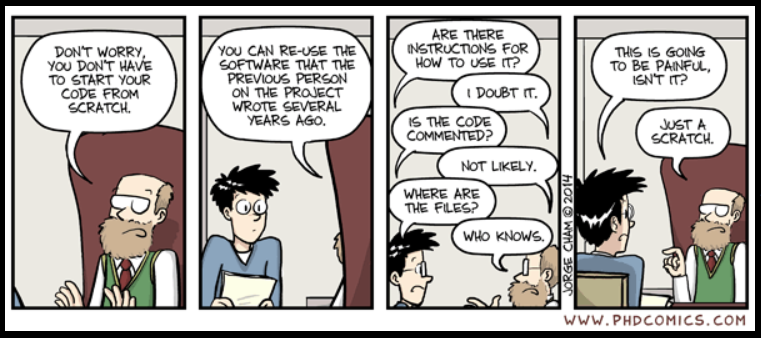

::: {layout-ncol="1"}
{width="100%"}

The Reproducible Data Analysis (RDA) course at **University do Algarve** focuses on methods for ensuring transparency and consistency in data analysis. Topics include the data analysis cycle, version control with Git, literate programming using R notebooks, and best practices for reproducibility.     
Course materials and resources are available here to support learning and practice.
:::
