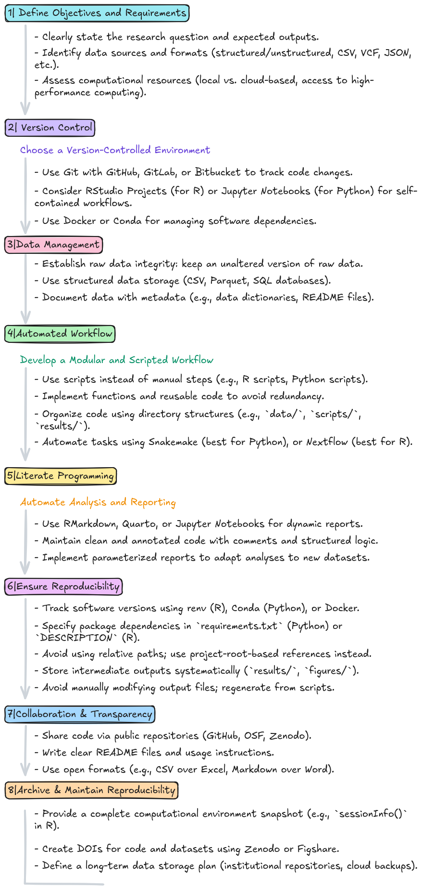

 

#### **Prerequisites | Mandatory**

  + You **should bring your own laptop**. This course teaches essential data analysis skills, including how to set up and manage your computing environment. Using your own laptop allows you to practice continuously and apply what you learn directly to your research.

  + An **RStudio Server** account will be used during the **first three classes** to introduce R.

  + **From class 4 onward**, you will install and configure **R, RStudio, and Git** on your own computer.

  + You must have **administrator privileges** on your computer in order to install software.

### How to setup your system for reproducible data analysis {.tabset}

Reproducibility is a cornerstone of reliable data analysis, ensuring that results can be consistently replicated and built upon.

Setting up a system for **reproducible data analysis** requires careful planning and adherence to best practices. Bellow is an overview of the **major steps** a researcher should take into consideration.

### Tools used for this course

In this course, we will use **R** and **RStudio** for data analysis, and **Git** and **GitHub** for version control:

- **R** is a powerful programming language designed for statistical computing and data analysis.  
- **RStudio** is an integrated development environment (IDE) that provides a user-friendly interface for writing, debugging, and managing R code.  
- **Git** is a version control system that tracks changes in code, allowing for efficient collaboration and history management.  
- **GitHub** is a cloud-based platform for hosting Git repositories, enabling code sharing, collaboration, and version tracking across teams.  

By combining these tools, researchers can streamline their workflows, ensure reproducibility, and foster collaboration and efficiency in data-driven projects.

### Install software

  1. First install R: <https://cran.r-project.org/>
  2. Then install RStudio: <https://posit.co/download/rstudio-desktop/>
  3. Install git: <https://git-scm.com/downloads>   
    - Detailed instructions for each Operating System (Linux, Mac, Windows) [here](https://git-scm.com/book/en/v2/Getting-Started-Installing-Git).
  4. Create an account in GitHub: <https://docs.github.com/en/get-started/start-your-journey/creating-an-account-on-github>

